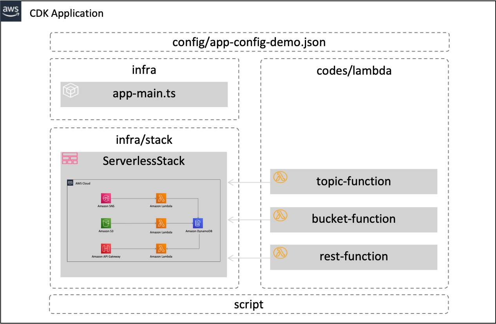
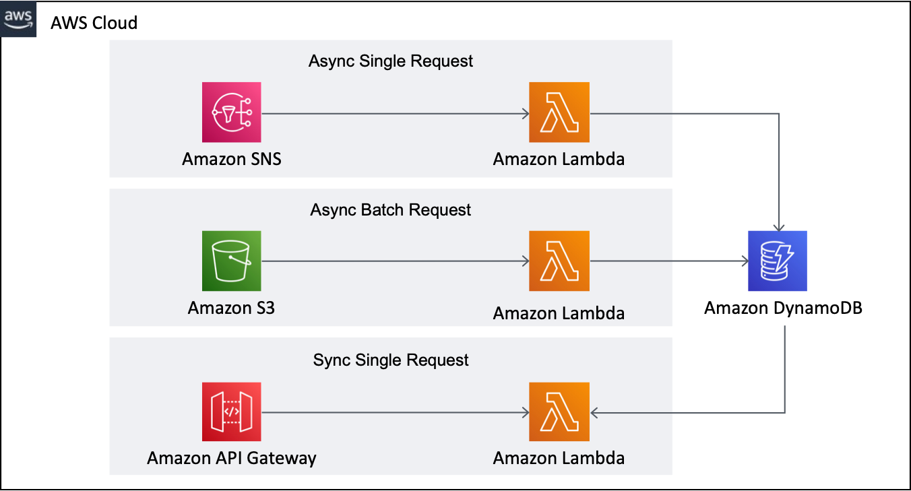

# AWS Serverless using AWS CDK

This repository provides the basic patterns of [AWS Serverless](https://aws.amazon.com/serverless) using [AWS CDK](https://aws.amazon.com/cdk).

## Contents

1. [**Repository structure**](#repository-structure)

2. [**Solution coverage**](#solution-coverage)
  
3. [**Solution architecture**](#solution-architecture)

4. [**How to deploy**](#how-to-deploy)

    - [**Prerequisites**](#prerequisites)
    - [**How to set up**](#how-to-set-up)
    - [**How to provision**](#how-to-provision)

5. [**How to test**](#how-to-test)

6. [**About CDK-Project**](#about-cdk-project)

7. [**How to clean up**](#how-to-clean-up)

8. [**Security**](#security)

9. [**License**](#license)

## **Repository structure**

Because this repository is basically a CDK-Project which is based on typescript, the project structure follows the basic CDK-Project form. This porject provide one stack and 3 lambdas. Before depoy this project, ***config/app-config.json*** should be filled in according to your AWS Account.



## **Solution coverage**

This repository introduces the common patterns of AWS Serverless.

- pattern 1: Amazon SNS -> Amazon Lambda -> Amazon DynamoDB
- pattern 2: Amazon S3 -> Amazon Lambda -> Amazon DynamoDB
- pattern 3: Amazon API Gateway -> Amazon Lambda -> Amazon DynamoDB

## **Solution architecture**

Specifically, it is implemented assuming that we are developing a ***book catalog service*** for easy understanding.

- flow 1: Async Single Request(Request to save one book)
- flow 2: Async Batch Request(Request to save a large of books)
- flow 3: Sync Single Request(Request for a list of books)



AWS services used are as follows:

- [Amazon Lambda](https://aws.amazon.com/lambda): a serverless computing which run code without thinking about servers
- [Amazon Simple Notification Service(SNS)](https://aws.amazon.com/sns): a fully managed messaging service for both application-to-application (A2A) and application-to-person (A2P) communication
- [Amazon Simple Storage Service(S3)](https://aws.amazon.com/s3): object storage built to store and retrieve any amount of data from anywhere
- [Amazon API Gateway](https://aws.amazon.com/api-gateway): a fully managed service that makes it easy for developers to create, publish, maintain, monitor, and secure APIs at any scale
- [Amazon DynamoDB](https://aws.amazon.com/dynamodb): a fast and flexible NoSQL database service for any scale

## **How to deploy**

To efficiently define and provision serverless resources, [AWS Cloud Development Kit(CDK)](https://aws.amazon.com/cdk) which is an open source software development framework to define your cloud application resources using familiar programming languages is utilized .


Because this solusion is implemented in CDK, we can deploy these cloud resources using CDK CLI. Among the various languages supported, this solution used typescript. Because the types of **typescript** are very strict, with the help of auto-completion, typescrip offers a very nice combination with AWS CDK.

***Caution***: This solution contains not-free tier AWS services. So be careful about the possible costs. Fortunately, serverless services minimize cost if not used(Amazon SageMaker's Endpoint is not serverless).

### **Prerequisites**

First of all, AWS Account and IAM User is required. And then the following must be installed.

- AWS CLI: aws configure --profile [profile name]
- Node.js: node --version
- AWS CDK: cdk --version
- [jq](https://stedolan.github.io/jq/): jq --version

Please refer to the kind guide in [CDK Workshop](https://cdkworkshop.com/15-prerequisites.html).

### **How to set up**

First of all, enter your project basic configuration in the follwoing document: ***config/app-config.json***. Fill in your project's "Name", "Stage", "Account", "Region", "Profile(AWS CLI Credentials)" in "Project" according to your environments.

```json
{
    "Project": {
        "Name": "ServerlessCdk",
        "Stage": "Demo",
        "Account": "75157*******",
        "Region": "us-east-1",
        "Profile": "cdk-demo"
    }
}
```

If you don't know AWS Account/Region, execute the following commands to catch your AWS-Account.

```bash
aws sts get-caller-identity --profile [your-profile-name]
...
...
{
    "Account": "[account-number]", 
    "UserId": "[account-id]", 
    "Arn": "arn:aws:iam::75157*******:user/[iam-user-id]"
}
```

And then execute the following commands to set up CDK-Project. For details, please check **setup_initial.sh** file.

```bash
sh ./script/setup_initial.sh  
```

### **How to provision**

Let's check stack included in this CDK-Project before provisining. Execute the following command. The prefix "***ServerlessCdkDemo***" can be different according to your setting(Project Name/Stage).

```bash
cdk list
...
...
ServerlessCdkDemo-ServerlessStack
```

Now, everything is ready, let's provision all stacks using AWS CDK. Execute the following command which will deploy all stacks in order of subordination.

```bash
sh script/deploy_stacks.sh
```

## **How to test**

For ***Async Single Request***, execute the following command, which will publish SNS message(script/input_sns.json) and finally the lambda functions will be executed to save one book into DynamoDB.

```bash
sh script/publish_sns.sh
...
...
{
    "MessageId": "e78906f5-4544-5e19-9191-5e9ea2a859bd"
}
```

After executing this command, please check your DynamoDB. You can find a new item in that.

For ***Async Batch Request***, execute the following command, which will upload a json file(script/input_s3.json) into S3 and finally the lambda functions will be executed to save a large of books into DynamoDB.

```bash
sh script/upload_s3.sh
...
...
upload: script/input_s3.json to s3://serverlesscdkdemo-serverlessstack-us-east-1-75157/batch/input_s3.json
```

After executing this command, please check your DynamoDB. You can find the multiple items in that.

For ***Sync Single Request***, execute the following command, which will send http-get request and finally the lambda functions will be executed to get a list of books in DynamoDB.

```bash
sh script/request_api.sh
...
...
[{"isbn": "isbn-01", "title": "book-01"}, {"isbn": "isbn-03", "title": "book-03"}, {"isbn": "isbn-02", "title": "book-02"}, {"isbn": "isbn-04", "title": "book-04"}]
```

## **About CDK-Project**

The `cdk.json` file tells the CDK Toolkit how to execute your app.

And the more usuful CDK commands are

- `cdk list`        list up CloudFormation Stacks
- `cdk deploy`      deploy this stack to your default AWS account/region
- `cdk diff`        compare deployed stack with current state
- `cdk synth`       emits the synthesized CloudFormation template
- `cdk destroy`     remove resources

## **How to clean up**

Execute the following command, which will destroy all resources except S3 Buckets and DynamoDB Tables. So destroy these resources in AWS web console manually.

```bash
sh script/destroy_stacks.sh
```

## **Security**

See [CONTRIBUTING](CONTRIBUTING.md#security-issue-notifications) for more information.

## **License**

This library is licensed under the MIT-0 License. See the LICENSE file.